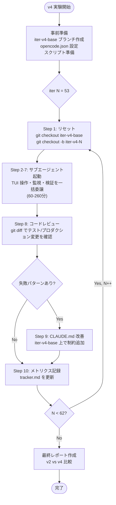
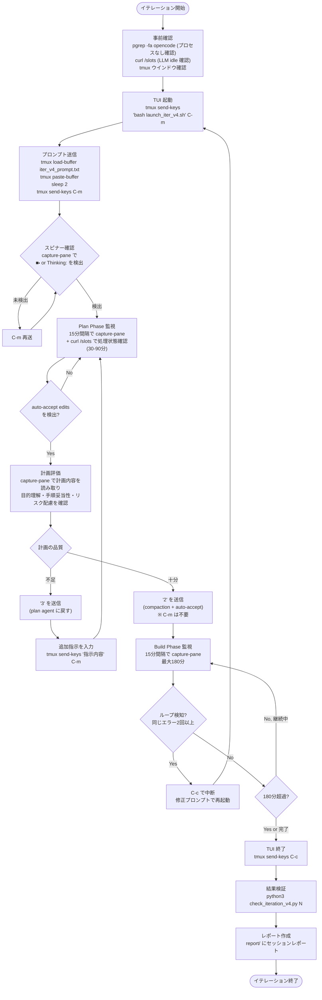
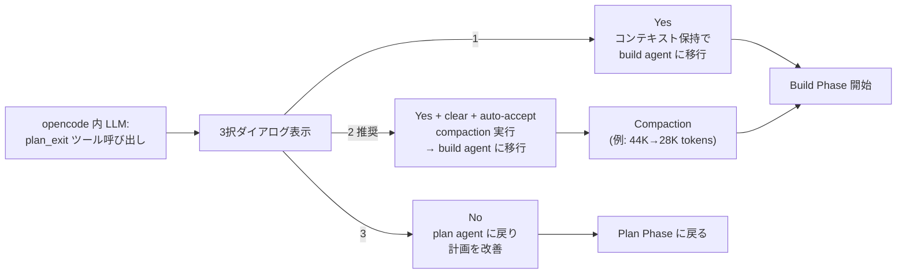
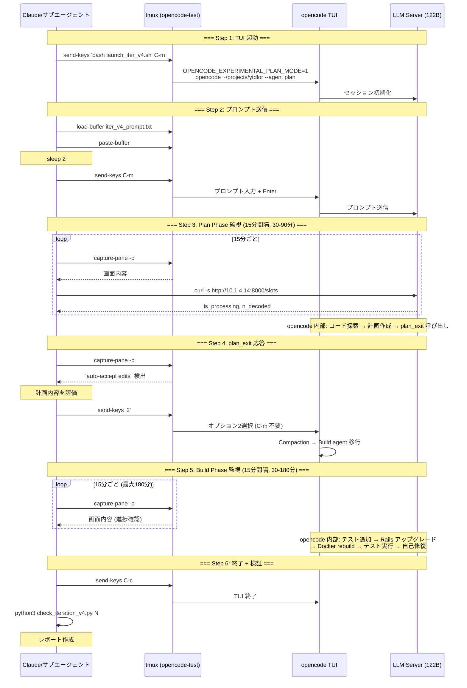

# v4 反復改善ループ: opencode 操作フロー分析レポート

- 日時: 2026-03-30 11:51 JST
- 作成者: Claude

## 前提条件・目的

- 目的: v4 反復改善ループ（iter 53-62）で Claude が opencode TUI に対してどのように Rails アップグレード作業を指示しているか、操作フローと実際のプロンプト例をまとめる
- 対象: Qwen3.5-122B-A10B モデルによる Rails 8.1 アップグレード実験（10回反復）

## 参照レポート

- [v4 トラッカー](./iteration-loop-v4-tracker.md)
- [v4 最終レポート](./2026-03-28_144425_iter-v4-final-report.md)
- [v4 計画](./attachment/iteration-loop-v4-plan.md)

---

## 1. 3層アーキテクチャ

v4 では以下の3層構造で作業が進行する:

| レイヤー | 実行主体 | 担当 |
|---------|---------|------|
| **オーケストレーション** | Claude（メインエージェント） | 実験制御、ブランチ管理、CLAUDE.md 改善判断、最終レポート |
| **TUI 操作 + 監視** | サブエージェント（または Claude 直接） | tmux 経由の TUI 起動・プロンプト送信・plan_exit 応答・build 監視・結果検証・レポート |
| **開発タスク実行** | opencode TUI 内 LLM (Qwen3.5-122B) | テスト追加、Rails アップグレード、Docker 操作、自己修復 |

---

## 2. フロー図

### 2.1 全体フロー（10回反復ループ）



### 2.2 1イテレーションの詳細フロー（Claude が opencode に行う操作）



### 2.3 plan_exit ダイアログの3択



### 2.4 tmux コマンドのシーケンス図



---

## 3. 実際のプロンプトとスクリプト

### 3.1 メインプロンプト（`tmp/iter_v4_prompt.txt`）

v4 では v2 と同一のプロンプトを全10回のイテレーションで使用:

```
以下の作業を行ってください。CLAUDE.md と .claude/skills/ の内容を必ず読んでから計画を立てること。

目標:
Rails を 8.1 にアップグレードする。アップグレード前にテストカバレッジを向上させ、
アップグレード後にリグレッションがないことを確認する。

手順:
1. 現在のコードを読み、テストが不足している箇所を特定する
2. 不足箇所のテストを追加し、アップグレード前のベースラインを確立する
3. Rails 8.1 へアップグレードする（Ruby 3.3+、load_defaults 8.1 を含む）
4. テストを実行してリグレッションがないことを確認する

制約:
- 各 Bash コマンドは個別に実行（&& や ; で繋がない）
- プロダクションコードを変更しない（テスト追加のみ）
- コメントアウトされたコードはアンコメントしない
- Gemfile.lock は削除しない。bundle update rails で更新する
- 外部サービスを実際に呼び出すテストは書かない（モック/スタブを使う）
- Docker テスト: ./docker_compose --profile test run --rm test rails test

計画が完了したら plan_exit ツールを呼ぶこと。
```

**プロンプト設計のポイント**:

| 要素 | 説明 |
|------|------|
| `CLAUDE.md と .claude/skills/ の内容を必ず読んで` | opencode にプロジェクト固有のルール（`&&` 禁止等）を読ませる |
| 目標セクション | **what**（何を達成するか）を伝え、**how** は opencode に委ねる |
| 手順セクション | 大まかな順序のみ指定。詳細は opencode が計画で決める |
| 制約セクション | 過去の失敗パターンから学んだ禁止事項をリスト化 |
| `plan_exit ツールを呼ぶこと` | Plan-First ワークフローの強制 |

### 3.2 TUI 起動スクリプト（`tmp/launch_iter_v4.sh`）

```bash
#!/bin/bash
OPENCODE_EXPERIMENTAL_PLAN_MODE=1 \
OPENCODE_EXPERIMENTAL_BASH_DEFAULT_TIMEOUT_MS=1200000 \
/home/ubuntu/projects/opencode/.claude/worktrees/rolling-truncation-plan-exit/packages/opencode/dist/opencode-linux-x64/bin/opencode \
~/projects/ytdlor --agent plan
```

| 環境変数/フラグ | 目的 |
|---|---|
| `OPENCODE_EXPERIMENTAL_PLAN_MODE=1` | plan_exit ツールの登録に必須 |
| `OPENCODE_EXPERIMENTAL_BASH_DEFAULT_TIMEOUT_MS=1200000` | Docker build 用に Bash タイムアウトを20分に延長 (iter 54→55 で追加) |
| `--agent plan` | plan agent で起動 |

**`--prompt` を使わない理由**: 複数行プロンプトは `tmux load-buffer` + `paste-buffer` の方が安全に送信できるため、起動とプロンプト送信を分離している。

### 3.3 プロンプト送信スクリプト（`tmp/send_iter_v4_prompt.sh`）

```bash
#!/bin/bash
TARGET="default:opencode-test"

# プロンプトテキストを tmux バッファにロード
tmux load-buffer /home/ubuntu/projects/opencode/tmp/iter_v4_prompt.txt

# バッファの内容をペースト
tmux paste-buffer -t "$TARGET"

# 2秒待ってから Enter を送信
sleep 2
tmux send-keys -t "$TARGET" C-m
```

**送信方式の選択理由**: `tmux send-keys` で長いテキストを送ると文字化けや途中切れの可能性がある。`load-buffer` + `paste-buffer` はファイル全体をバッファ経由でペーストするため、複数行プロンプトの送信に適している。

---

## 4. 監視と検証

### 4.1 検出文字列と対応アクション

| 検出文字列 | 意味 | Claude のアクション |
|-----------|------|-------------------|
| `auto-accept edits` | plan_exit ダイアログ表示 | 計画を評価し `'2'` を送信 |
| `Build ` | build agent に移行済み | 監視を継続 |
| `Context cleared` | compaction 完了 | 監視を継続 |
| `Thinking:` | LLM reasoning 中 | 待機（最低5分） |
| `ubuntu@` | TUI 終了済み | 検証フェーズへ進む |

### 4.2 結果検証スクリプト（`tmp/check_iteration_v4.py`）

TUI 終了後に実行し、以下を自動判定:

| チェック項目 | 合格条件 | 取得方法 |
|------------|---------|---------|
| Rails バージョン | `8.1.x` | Gemfile.lock を grep |
| load_defaults | `8.1` | config/application.rb を grep |
| Ruby (Gemfile) | `>= 3.3` | Gemfile を grep |
| Ruby (Dockerfile) | `>= 3.3` | Dockerfile を grep |
| プロダクションコード変更 | `app/` 配下の変更なし | git diff で確認 |
| Truncation 発動回数 | 記録 | SQLite DB から取得 |
| Context token ピーク | 記録 | SQLite DB から取得 |

---

## 5. セッション実例: iter 55（全条件達成、158分、介入0回）

```mermaid
gantt
    title iter 55 タイムライン (2026-03-27)
    dateFormat HH:mm
    axisFormat %H:%M

    section Plan Phase (75分)
    CLAUDE.md/skills 読み込み          :p1, 04:29, 15min
    サブエージェント探索 (27 calls)     :p2, 04:44, 30min
    モデル/コントローラ読み込み         :p3, 05:14, 15min
    計画ファイル作成                    :p4, 05:29, 15min

    section plan_exit
    ダイアログ → '2' 選択             :crit, pe, 05:44, 1min

    section Build Phase (83分)
    Compaction + テスト追加            :b1, 05:45, 15min
    bundle update                     :b2, 06:00, 15min
    Docker rebuild                    :b3, 06:15, 30min
    テストデバッグ                     :b4, 06:45, 15min
    テスト完了 (27 runs, 3F)          :b5, 07:00, 7min
```



**監視ログ**:

| T+ | Context | 状態 |
|---|---|---|
| 15m | 26K (20%) | Plan: ファイル読み込み中、サブエージェント探索中 |
| 30m | 28K (22%) | Plan: サブエージェント完了 (27 tool calls / 12m50s) |
| 75m | 41K (31%) | plan_exit ダイアログ表示 → `'2'` 選択 |
| 90m | 28K (22%) | Build: Compaction 後、テスト追加完了 |
| 120m | 50K (38%) | Build: Docker rebuild 完了 |
| 150m | 85K (65%) | Build: テスト再実行中 |
| 165m | 88K (67%) | 完了: 27 runs, 35 assertions, 3 failures, 0 errors |

**opencode の自己修復 (Claude 介入なし)**:
1. Ruby 3.3.0 と Rails 8.1.3 の互換性問題を検出 → Ruby 3.3.6 に自動切り替え
2. docker_compose ファイル名の読み込みエラー → 自力修復
3. 日本語テキストのエンコーディング問題 → Python スクリプトで修正
4. テストアサーションを実際のモデル動作に合わせて修正

---

## 6. 結果・所見

### Claude の操作は最小限

v4 フローにおいて Claude が opencode に対して行う操作は以下のみ:

1. **TUI 起動**: `bash launch_iter_v4.sh` を tmux で実行
2. **プロンプト送信**: `bash send_iter_v4_prompt.sh` を実行
3. **15分間隔の監視**: `tmux capture-pane` で画面確認
4. **plan_exit 応答**: `'2'` を送信（計画承認）
5. **TUI 終了**: `C-c` を送信

Build phase での介入は原則なし（全10回中 0-2 回のみ）。opencode 内の LLM が計画立案から実行・テスト・自己修復まで自律的に処理する。

### フロー上のボトルネック

| ボトルネック | 影響 | v4 での対策 |
|------------|------|------------|
| 122B モデルの推論速度 | Plan phase 30-90分 | タイムアウト 180分に延長 |
| Docker rebuild | Build phase の大部分 | Bash timeout 20分に延長 (iter 55+) |
| Context 消費 | Docker ログがトークン大量消費 | Rolling Truncation + Compaction |
