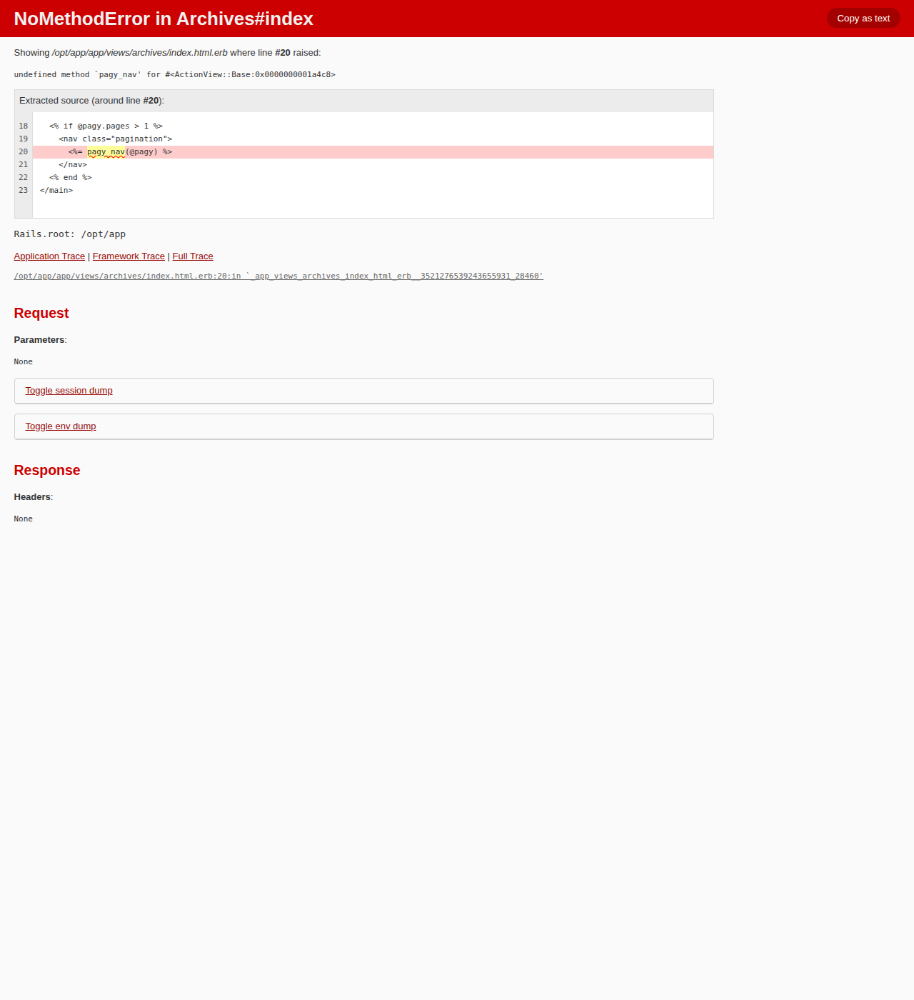
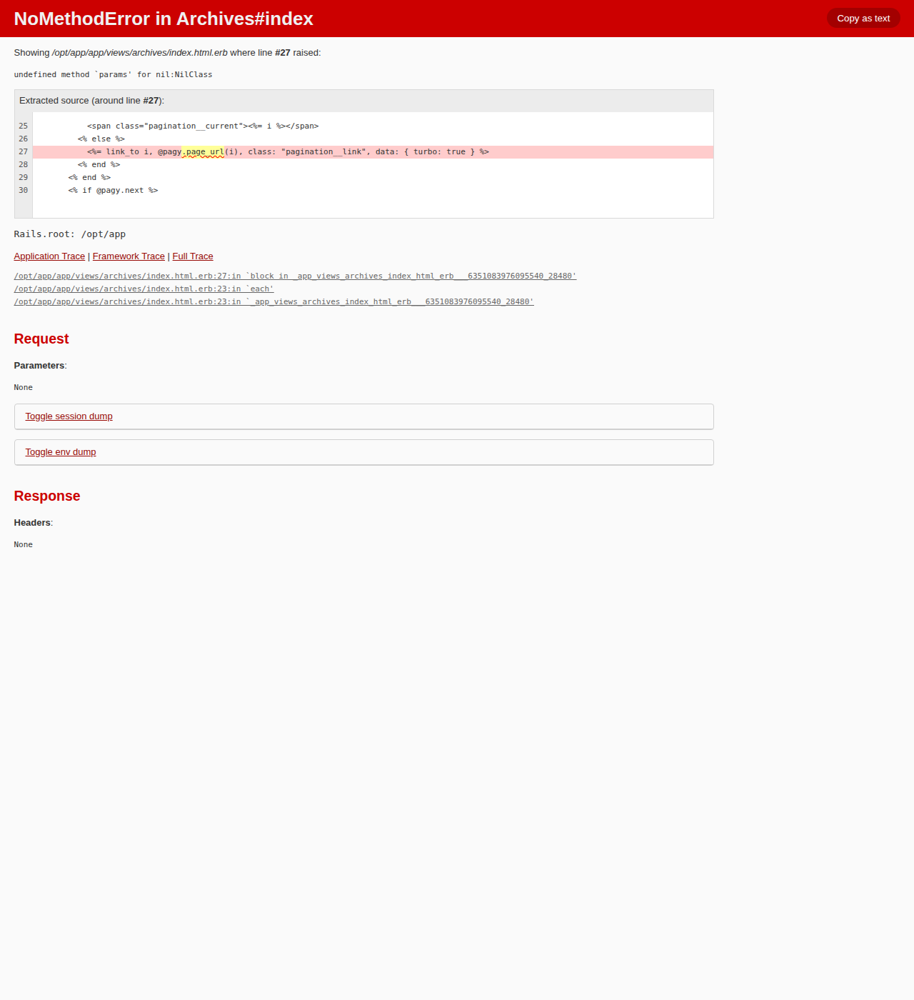

# opencode 機能追加ベンチマーク（検索 / ページネーション）レポート

- 日時: 2026-05-30 06:48 JST
- 作成者: Claude

## 添付ファイル

- [実装プラン](attachment/2026-05-30_064849_opencode_feature_bench/plan.md)
- [全試行結果 TSV](attachment/2026-05-30_064849_opencode_feature_bench/results.tsv)
- スクリーンショット（本文に埋め込み。ディレクトリ: `attachment/2026-05-30_064849_opencode_feature_bench/screenshots/`）

## 前提条件・目的

- **目的**: opencode + ローカル LLM（Qwen3.6-35B-A3B）が、実プロジェクト ytdlor（Rails 8.1）へ実用的な機能追加をどこまで自律的にこなせるかを定量評価する。
- **比較軸**: 「**opencode が自らプランを立てる（selfplan）**」場合と「**claude が立案した詳細プランを与える（givenplan）**」場合で、成果物の品質がどう変わるかを比較する。両パターンとも opencode の plan モードを使用し、差はプロンプト内容のみ（A=要件のみ / B=要件＋claude の詳細プラン）。
- **評価**: 参照ベンチ [2026-05-21 5モデルベンチ](./2026-05-21_032451_qwen36_5model_bench.md) と同じ **claude code による LLM as judge**（correctness / idiomaticity / completeness / test_quality を各 1-5 + 総合 score）。加えて本ベンチでは **Playwright によるブラウザ実機ユーザーテスト**を全試行に実施し、ユニットテストでは捕捉できない実行時の動作可否を客観確認した。

### 実験マトリクス（合計 20 試行）

| タスク | パターン | 試行 |
|---|---|---|
| 検索機能 | selfplan（要件のみ） | 5 |
| 検索機能 | givenplan（claude プラン提示） | 5 |
| ページネーション | selfplan | 5 |
| ページネーション | givenplan | 5 |

### タスク仕様（opencode へのプロンプト）

- **タスク1 検索**: 一覧（ArchivesController#index）に検索機能を追加 / `Archive#title` 部分一致 / 検索 UI を適切に配置 / **テストも実装して実行**。
- **タスク2 ページネーション**: 一覧にページネーション追加 / **1ページ20件** / ページ下部に UI 配置 / 既存テストが壊れないこと。（注: ユーザー仕様にテスト実装の明記なし → test_quality は新規テストが無くても過度に減点しない非対称採点。本文で明記。）

## 環境情報

- GPU/LLM サーバ: `t120h-p100`（10.1.4.14:8000, OpenAI 互換 API）
- モデル: `unsloth/Qwen3.6-35B-A3B-GGUF:UD-Q4_K_XL`（131072 ctx）
- opencode: **1.15.12**（TUI 表示。`/home/ubuntu/.opencode/bin/opencode`）
- ベンチ対象: ytdlor（Rails 8.1.2 / Ruby 3.2.4 / PostgreSQL 14 / Minitest / docker-compose）
- ベース: `rails-upgrade-to-8.1.0` ブランチ HEAD = `b61242f` から 20 worktree を fork（`/home/ubuntu/projects/ytdlor/.claude/worktrees/bench-feat-*`）。各 worktree は独立ブランチとして保持し、後から `git checkout` で任意試行のコードを振替・比較可能。
- ブラウザテスト: Playwright 1.60（chromium-headless-shell）。ytdlor を専用 docker compose プロジェクト `ytdlor-featbench`（port 3010）で起動し、本番（`ytdlor-production`, port 8001）・dev（`ytdlor`, port 3000）とは隔離。25 件（Ruby 12 / Python 13）のシードデータを投入して検証。

## ベンチマーク設計と駆動手順

各試行は次のフローで実行した（claude が tmux 右ペインの opencode TUI を駆動）:

1. `opencode <worktree> --agent plan --prompt "<要件 or 要件+プラン>"` で plan エージェント起動。
2. plan 提示まで待機（画面の busy 状態消失を検知）。
3. **Tab で build エージェントへ切替** → 実装指示メッセージ送信。
4. build 完了まで待機。
5. opencode 終了 → 差分メトリクス収集 → 独立テスト実行（`./docker_compose run --rm -e RAILS_ENV=test web bin/rails test`）→ Playwright 実機テスト＋スクリーンショット → docker teardown。

### 技術的知見（実行中に判明した重要事項）

#### 1. plan_exit がローカル35Bでは自発されない（→ Tab で build 切替で代替）

機能追加タスクでは、plan エージェントがプラン全文を提示した後 **`plan_exit` ツールを呼ばず、確認質問（例「この方針で進めます。迷いはありませんか？」）を出して停止**する挙動が一貫して観測された。

- 当初 `OPENCODE_EXPERIMENTAL_PLAN_MODE=1` の未設定を疑ったが、ソース確認（`packages/opencode/src/effect/runtime-flags.ts:49`, `session/reminders.ts:40`）で **この環境変数は不要**と判明（`!experimentalPlanMode` 側が現行の plan モード本体で、plan_exit のリマインダを注入している）。リグレッションスキルでも plan_exit は検証済みで、極小タスク（Rakefile へのコメント追加）では plan_exit を直行する。
- **真因**: plan モードのリマインダ（`reminders.ts:25-27`）は「プラン全文を提示し、**質問を投げる or plan_exit を呼べ**。どちらか無しにターンを終えるな」と**両方を許容**している。確認を要する複雑な機能追加タスクでは、Qwen3.6-35B が**質問の方を選択**して停止する。タスク複雑度依存の挙動でありバグではない。
- plan モードのまま確認応答（「進めて」）を返すと、plan エージェント（app/ 編集権限なし）が bash で `/tmp` へ書き込むハックを試み構文エラーを連発した（不適切経路）。
- → **採用手順**: プラン提示後に **Tab で build エージェントへ切替 → 実装指示**。build エージェントは全権限（`* allow`）で Edit ツールにより正しく実装し、テストも実行できる。全 20 試行でこの方式を用いた。

#### 2. ベンチ用 AGENTS.md への差替（採点 diff からは除外）

リポジトリの `AGENTS.md` は Rails アップグレード作業専用で「**app/ 配下を一切変更するな**」という制約を含み、機能追加タスクと矛盾する。そのため各 worktree の AGENTS.md を、環境情報（`./docker_compose` でのテスト・Minitest 限定・日本語）は残しつつ app/ 禁止・アップグレード専用手順を除いた機能開発用に差し替え、setup commit として記録した（採点 diff のベースをこの setup commit に設定し、AGENTS.md 変更は採点対象外）。

#### 3. テスト実行は worker 非依存の web サービスで（DB セッション競合回避）

opencode が `./docker_compose --profile test` でテストすると、`test` サービスが依存する worker が DB 接続を保持し `PG::ObjectInUse: database "ytdlor_test" is being accessed by other users` でリトライループに陥った。AGENTS.md のテスト手順を **`./docker_compose run --rm -e RAILS_ENV=test web bin/rails db:test:prepare && ... test`**（worker 非依存・`--rm`）に変更して解消。

#### 4. 自動駆動ハーネスの堅牢化（途中で判明したバグと修正）

16 試行の自動化スクリプト（`drive_opencode.sh`）で以下を修正した（レポート反映依頼事項）:
- **busy 判定**: 当初フッタの "interrupt" 文字のみで判定したが、plan エージェントが **Explore サブエージェント**を使う間は "interrupt" が消え（braille スピナー表示に変わる）、誤って完了判定 → 実装ゼロで終了した。busy 判定に **braille スピナー検出**を追加。さらに「Explore Task」等の履歴テキストは完了後も残るため busy 判定に使わないよう修正。
- **external_directory ダイアログ**: Explore サブエージェントが worktree の親リポジトリ `~/projects/ytdlor` を読もうとして権限ダイアログで停止（30分待ち）。各試行のグローバル設定（XDG_CONFIG_HOME）で `external_directory: allow` を付与して回避（プロジェクト opencode.json は改変せず）。
- **プラン段階の追加質問ダイアログ**: plan 提示後に opencode が UI スタイル等の数値選択質問を出す場合があり、Tab+指示が質問の回答として消費され実装ゼロになった。**質問ダイアログ検知時は Escape で閉じてから Tab→build** する処理を追加。

## 結果

### セル別サマリ（n=5）

| タスク | パターン | functional（実機動作） | test pass | judge score | correct | idiom | complete | test_q |
|---|---|---|---|---|---|---|---|---|
| 検索 | selfplan | **5/5** | 5/5 | **4.0** | 4.6 | 3.8 | 4.2 | 4.0 |
| 検索 | givenplan | **5/5** | 5/5 | **4.6** | 5.0 | 5.0 | 5.0 | 4.0 |
| ページ | selfplan | **3/5** | 5/5 | **3.8** | 3.4 | 4.0 | 3.8 | 3.0 |
| ページ | givenplan | **5/5** | 5/5 | **5.0** | 5.0 | 4.6 | 5.0 | 5.0 |

- **functional**: Playwright 実機テストで機能が正しく動作（検索=部分一致で 25→12 件に絞込 / ページ=1ページ20件・2ページ目5件）。
- **test pass**: claude が独立実行した `rails test` が 0 failures / 0 errors（全 20 試行とも通過）。

### パターン別（タスク横断, n=10）

| パターン | functional | judge score 平均 |
|---|---|---|
| **selfplan**（自己プラン） | **8/10** | **3.9** |
| **givenplan**（claude プラン提示） | **10/10** | **4.8** |

### 主要比較：自己プラン vs 与プラン

- **両タスクで givenplan が selfplan を上回った**（検索 4.6 vs 4.0、ページ 5.0 vs 3.8）。
- 効果が最も顕著なのは**ページネーション**。selfplan では opencode が gem 選定から行い、`kaminari` を選んだ試行（r1/r3/r5）は全て成功した一方、**`pagy` を選んだ 2 試行（r2/r4）は実機でクラッシュ**した。givenplan は claude プランが `kaminari` を指定していたため 5/5 が完璧に動作。
- 検索では機能はどちらも 5/5 動作したが、selfplan は **PostgreSQL で大文字小文字を区別する `LIKE`** を使う試行（r2/r5）があり idiomaticity・correctness を落とした。givenplan は `ILIKE` 指定が徹底され全試行で満点級。
- **示唆**: ローカル 35B でも要件のみで実用的な機能を実装できるが、**ライブラリ選定や SQL 方言の細部で品質がばらつく**。具体的なプラン（gem・実装方針）を与えると、ばらつきが消え再現性高く高品質になる。

### 故障モード：ユニットテストをすり抜けた実機クラッシュ（重要）

ページネーション selfplan の 2 試行は **`rails test` は 33 件全通過したのにブラウザ実機ではクラッシュ**した。これは **ブラウザ実機テストがユニットテストの見逃したバグを捕捉した**好例である。

- **page-selfplan-r2**（pagy）: view で `pagy_nav(@pagy)` を呼ぶが `Pagy::Frontend` を未 include → `NoMethodError: undefined method 'pagy_nav'`。テストは archive 1 件のため `@pagy.pages > 1` 分岐を踏まず素通り。実機（25件）では pages>1 で発火しクラッシュ。
- **page-selfplan-r4**（pagy）: `@pagy.page_url(i)` を誤用 → `undefined method 'params' for nil`。同様にテストすり抜け・実機クラッシュ。

opencode（Qwen3.6-35B）は **pagy の API を正しく扱えていない**（version 指定も r2=8.6.3 / r4=43.4.4 とばらつき、include 漏れ・ヘルパ誤用）。学習データ的に枯れた `kaminari` の方が安定して正しく書けている。

## スクリーンショット（実機テスト）

検索 selfplan-r1（"Ruby" 検索で 12 件に絞込・成功）:

ページ selfplan-r1（kaminari・2ページ目に5件＋ページネーションUI・成功）:

ページ givenplan-r1（kaminari・成功）:

故障例 page-selfplan-r2（pagy・`pagy_nav` undefined で index がクラッシュ）:

故障例 page-selfplan-r4（pagy・`@pagy.page_url` 誤用で `params for nil` クラッシュ）:

## その他の所見

- **所要時間**: givenplan は plan 段階が速く（プラン提示 ~2分 vs selfplan ~3-7分）、build も短い傾向（プランが具体的なため反復が少ない）。一部に長時間化（page-givenplan-r4 が docker 再ビルド・反復で約27分）も見られたが成果物は完璧だった。
- **opencode の自律性**: build エージェントは Gemfile への gem 追加・`./docker_compose build web` での bundle 解決・Gemfile.lock 更新・テスト実行までを自律的にこなせた（kaminari 群は Gemfile.lock も正しく更新）。
- **plan_exit**: 本ベンチの機能追加タスクでは plan_exit が自発されず、Tab→build で代替した（上記「技術的知見1」）。この挙動はタスク複雑度依存であり、極小タスクでは plan_exit が機能する点に留意。

## 再現方法

ハーネス一式は `/home/ubuntu/projects/opencode/tmp/feat-bench/` に保存:

- `create_worktrees.sh` / `apply_setup.sh`: 20 worktree 作成 + 機能開発用 AGENTS.md の setup commit
- `prompts/{search,page}_{selfplan,givenplan}.txt`: opencode へのプロンプト（givenplan は claude の詳細プラン入り）
- `launch_trial.sh`: opencode TUI 起動（XDG 分離・external_directory 許可のグローバル設定）
- `drive_opencode.sh`: 1試行の自動駆動（plan→Tab→build→終了→メトリクス）
- `evaluate_trial.sh` + `app_up.sh` / `seed.rb` / `pw_test.mjs` / `app_down.sh`: 独立テスト + ブラウザ実機テスト + スクショ
- `aggregate.py`: 集計（results.tsv 生成）
- `results/<trial>.{json,diff,stat}` + `judge_<trial>.json`: 各試行の客観結果・差分・採点

任意試行のコードは `git -C /home/ubuntu/projects/ytdlor checkout bench-feat-<task>-<pattern>-r<n>` で取り出せる。

## 参照レポート

- [2026-05-21 Qwen3.6 5モデルベンチ](./2026-05-21_032451_qwen36_5model_bench.md)（LLM as judge 手法・worktree 分離の元）

## 結果・所見（まとめ）

- **opencode + Qwen3.6-35B は、ytdlor への検索・ページネーション追加を実用レベルで実装できる**。全 20 試行で独立テストは 0 failures、機能動作は **18/20**。
- **claude の詳細プランを与える（givenplan）と、自己プラン（selfplan）より明確に高品質**（functional 10/10 vs 8/10、judge 4.8 vs 3.9）。プラン提示は特に**ライブラリ選定の失敗（pagy 誤用）や SQL 方言（LIKE/ILIKE）のばらつきを抑制**する効果が大きい。
- **ブラウザ実機テストの価値**: ユニットテストを通過しても実機で動かない実装（pagy の 2 例）を確実に捕捉できた。テスト pass だけでは品質を担保できないことを実証。
- **留保事項**: 機能追加タスクでは plan_exit が自発されず Tab→build で代替したこと、AGENTS.md を機能開発用に差し替えたこと、external_directory を許可したことは、いずれもベンチ成立のための運用上の調整であり結果解釈時に留意が必要。
