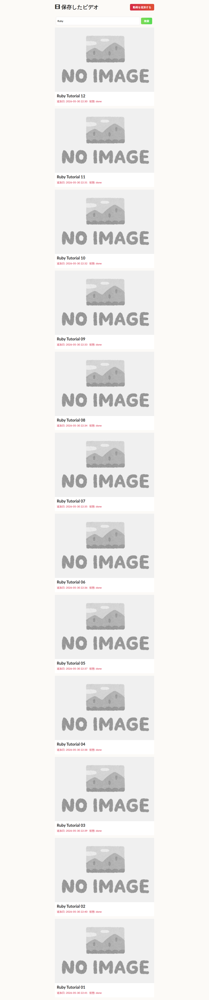

# opencode plan_exit 自発化に向けたシステムプロンプト改善の検証レポート

- 日時: 2026-05-30 22:27 JST
- 作成者: Claude

## 添付ファイル

- [実装プラン](attachment/2026-05-30_222734_planexit_systemprompt_bench/plan.md)
- [全条件サマリ TSV](attachment/2026-05-30_222734_planexit_systemprompt_bench/planexit_summary.tsv)
- 代表試行 JSON: [dev 自発](attachment/2026-05-30_222734_planexit_systemprompt_bench/sample_dev_self_exit.json) / [1.15.12 停止](attachment/2026-05-30_222734_planexit_systemprompt_bench/sample_v11512_stall.json)
- end-to-end: [検索結果スクショ](attachment/2026-05-30_222734_planexit_systemprompt_bench/e2e_search_results.png) / [Playwright 結果](attachment/2026-05-30_222734_planexit_systemprompt_bench/e2e_result.json)

## 前提条件・目的

- **背景**: 前回の機能追加ベンチ（[2026-05-30 機能追加ベンチ](./2026-05-30_064849_opencode_feature_bench.md)）で、「機能追加のような確認を要するタスクでは plan エージェントが `plan_exit` を自発せず、確認質問を出して停止する」ことが観測され、全試行で人手の「Tab→build 切替」代替を要した。
- **目的**: opencode のシステムプロンプト（plan モードの reminder テキスト）を改善し、ローカル Qwen3.6-35B で `plan_exit` が自発される（= Tab→build 代替なしで build に到達する）ようにできるかを検証する。3 つの汎用プロンプト改善案を設計し、同一の機能追加タスクで plan_exit 自発率を定量比較する。
- **主指標**: **plan_exit 自発率**。plan フェーズのみ駆動し、reminder エスカレーションの自然な帰結を観測して分類する（**主指標の 100 試行は** build/docker/Playwright を回さない軽量計測）。加えて、代表 1 試行のみ別途 end-to-end（build + 実機テスト）で plan_exit→build ループの健全性を確認する（後述「end-to-end 検証」）。

## 環境情報

- GPU/LLM サーバ: `t120h-p100`（10.1.4.14:8000, OpenAI 互換 API）。サンプラーは temperature 0.55 / DRY 無効（`dry_multiplier=0`）。
- モデル: `unsloth/Qwen3.6-35B-A3B-GGUF:UD-Q4_K_XL`（131072 ctx）
- 検証対象 opencode:
  - **dev ビルド（fork 現行 = baseline/A/B/C のベース）**: `dev` ブランチ HEAD `c02e4cd77` をワークツリー `planexit-bench` で `bun build --single` した自前バイナリ（version `0.0.0-planexit-bench-*`）。
  - **v11512**: インストール済み `/home/ubuntu/.opencode/bin/opencode`（**1.15.12**、前回ベンチで使用したバイナリ）。
- ベンチ対象: ytdlor（Rails 8.1）。`b61242f` + 機能開発用 `AGENTS.bench.md` のクリーン setup から 20 worktree を fork。
- 試行マトリクス: 検索/ページ × selfplan/givenplan × 5 試行 = 20 試行/条件。**5 条件（baseline, A, B, C, v11512）で計 100 試行**。

## 参照レポート

- [2026-05-30 機能追加ベンチ](./2026-05-30_064849_opencode_feature_bench.md)（plan_exit 非自発の観測元、ハーネスの元）

## 3 案の内容（`reminders.ts` の legacy plan モード用 `planEnteringSuffix` 改訂）

現行は legacy plan モードパス（`experimentalPlanMode` 既定 false）。主レバーは初回 plan ターンに注入される `planEnteringSuffix`（`packages/opencode/src/session/reminders.ts:17-27`）。

- **案A（ファイル書込強制）**: 「プランを必ずプランファイルに Write してから plan_exit を呼べ。チャット提示だけでは不可」。既存の `forcePlanExit`/synthetic 機構（プランファイル存在が発火条件）を確実に作動させる狙い。
- **案B（質問抑制 / plan_exit デフォルト化）**: 「自信のあるプランの確認質問は冗長。plan_exit が承認提示を兼ねるので確認質問せず plan_exit を呼べ」。
- **案C（A+B 併用）**: ファイル書込強制と質問抑制を両立。

（3 案の全文はプラン添付に記載。）

## ベンチ設計と駆動手順

各試行: `reset_to_setup`（クリーン setup へ git reset）→ `drive_plan_only`（plan エージェント起動、Tab/Escape はせず reminder エスカレーションの自然な帰結を待つ）→ opencode 終了 → セッション SQLite DB を解析して分類。

**plan_exit 帰結の客観分類**（`classify_plan_exit.py`、opencode の channel DB `*.db` を解析）:
- **self_exit**: メインセッション（plan, parent_id NULL）の part に `tool=="plan_exit"` が存在（ファイル不在 throw を除く）。reminder 0 回 = autonomous / >0 = induced。plan_only ではダイアログを Yes 応答しないため、`plan_exit_state` は「ユーザーがダイアログを閉じた」エラーになるが、これは自発呼出の証跡。
- **synthetic**: `"synthetic plan_exit by safeguard"` テキスト part（セーフガード発火）。
- **stall**: 上記いずれも無し（プラン提示後に確認質問等で停止）。
- 併せて plan_file_written（`<wt>/.opencode/plans/*.md` 非空）と reminder 回数を記録。

## 技術的知見（実行中に判明した重要事項）

1. **旧 setup commit の汚染（早期スモークで捕捉）**: 前回ベンチの `base_shas.tsv` が指す setup commit には**前回の実装（検索機能）が混入**していた。リセット先がこれだと「既に実装済み・変更不要」とモデルが結論し計測が無効になる。`b61242f` + `AGENTS.bench.md` から全 20 worktree のクリーン setup を再構築（`clean_base_shas.tsv`、検索実装なしを検証）して解消。
2. **カスタムビルドの更新ダイアログ**: 自前ビルド（version `0.0.0-*`）は起動時に「Update Available v1.15.12」ダイアログを出し駆動を妨げる。XDG グローバル設定の `autoupdate:false` と `OPENCODE_DISABLE_AUTOUPDATE=1` で抑止。
3. **試行間の起動レース**: 前トライアルの opencode が完全終了する前に次の起動コマンドを送ると、キーストロークが残存 TUI の入力欄に吸われ opencode が起動せず（DB 未作成）stall 誤判定する。起動前に opencode UI マーカーが消えるまで C-c を送る preflight を追加して解消（B 条件で 1 件発生したが再実行で self_exit を確認）。
4. **分類はセッション DB から**: opencode はメッセージ/パートを SQLite（channel DB）に格納。Python sqlite3 で plan_exit ツール part・synthetic テキスト・reminder テキストを解析し客観分類した（TUI 文字列依存を回避）。
5. **検証バイナリの取り違え（fork vs upstream）— 本件の本質的教訓**: 前回の機能追加ベンチ（[2026-05-30](./2026-05-30_064849_opencode_feature_bench.md)）は `launch_trial.sh` が `~/.opencode/bin/opencode` をハードコードしていたため、**upstream の 1.15.12 を対象に実行されていた**（`~/.opencode` は npm `@opencode-ai/plugin@1.15.12` 由来の upstream 版で、2026-05-29 に配置）。upstream には fork 独自の plan_exit 機構（`forcePlanExit`/synthetic safeguard、`625f65dc8`/`ce81fff49`）が無いため、「plan_exit が自発されない」という観測は**fork の挙動ではなく upstream の挙動**だった。一方、fork のリグレッションスキル（`plan-exit-regression` 等）は結果ファイルの `Binary:` 行が示すとおり一貫して **fork の dist ビルド**（`…/dist/opencode-linux-x64/bin/opencode`）を対象にしており、正しく fork を検証していた。「リグレッションでは plan_exit OK / 機能ベンチでは非自発」という食い違いは、この**対象バイナリの差**が正体である。
   - **対策**: `launch_trial.sh` の既定バイナリを `~/.opencode/bin/opencode`（upstream）から **fork の dist ビルド**（`packages/opencode/dist/opencode-linux-x64/bin/opencode`）へ変更し、未ビルド時は明示エラーで停止、起動時に `--version` をログ（fork は `0.0.0-<branch>-*`、upstream は `1.15.12`）して取り違えを検知できるようにした。今後、fork の挙動を測るベンチは installed 版に依存させない。

## 結果

### 条件別サマリ（n=20/条件、ALL 行）

| 条件 | self_exit(自発) | synthetic | stall | **self_exit率** | plan_file_written率 | 平均reminder |
|---|---|---|---|---|---|---|
| **baseline（dev）** | 20 | 0 | 0 | **100%** | 100% | 0.0 |
| **A（ファイル書込強制）** | 20 | 0 | 0 | **100%** | 100% | 0.0 |
| **B（質問抑制）** | 20 | 0 | 0 | **100%** | 100% | 0.0 |
| **C（A+B）** | 20 | 0 | 0 | **100%** | 100% | 0.0 |
| **v11512（1.15.12）** | 0 | 0 | 20 | **0%** | 0% | 0.0 |

- dev 系（baseline/A/B/C）は **検索/ページ × selfplan/givenplan の全 16 セルで 100% self_exit_autonomous**（reminder 不要で直接 plan_exit）。
- v11512（1.15.12）は **全 20 試行で stall**（self_exit 0%、plan ファイルも書かれない）。
- 3 案（A/B/C）は baseline と完全に同等（全て 100%）。**プロンプト変種による差は無い**。

### dev と 1.15.12 の挙動差（根本原因）

セッション DB の精査で、両者のモデル挙動が明確に異なることが判明:

- **dev（fork 現行）**: `Explore（task）→ プランをプランファイルに Write（completed）→ plan_exit を呼ぶ`。reasoning に「The plan is written. Now I should exit plan mode」と明示し、確認質問なしで plan_exit に直行。→ self_exit 100%。
- **1.15.12（upstream）**: `Explore（task）→ プランをチャットにインライン提示（ファイルに書かない）→ \`question\` ツールで確認質問`。plan_exit を呼ばずファイルも書かず停止。→ stall 100%。

両ビルドとも `question` ツールは有効（client=cli）だが、**fork の plan-mode プロンプト（`planEnteringSuffix` のファイル書込+plan_exit 強調、および fork 独自の `forcePlanExit`/synthetic safeguard 機構）が、モデルを「ファイル書込→plan_exit」へ確実に誘導**している。これらの plan_exit 機構は fork オーナー作の独自実装（`625f65dc8` 2026-03-19 "add plan_exit forced reminder", `ce81fff49` 2026-05-10 "synthesize plan_exit when reminder limit reached"）であり、**upstream 1.15.12 には無い**。

→ **前回ベンチで観測された「plan_exit が自発されない」問題は、前回使用した upstream 1.15.12 に固有であり、fork の現行 dev ビルドでは既に解消している**。

## 3 案の評価

- baseline（dev、無改変）が既に 100% self_exit のため、3 案はいずれも**改善余地のない天井**に対する変更であり、効果差は観測されなかった（全て 100%）。
- 案B（質問抑制のみ・ファイル書込を強制しない）は理論上ファイル未書込で停止しうるが、`planEnteringSuffix` 冒頭の「create your plan at ${plan} using the write tool」が残るため、実測でもモデルはファイルを書き 100% self_exit した（唯一の stall は起動レースのハーネス由来で、再実行で self_exit を確認）。
- **「最も効果的な案」は判定不能（全案が baseline と同等）**。真の決定要因はプロンプト案の差ではなく、**fork の既存 plan-mode 実装（dev）か upstream 1.15.12 か**である。

## end-to-end 検証（dev の plan_exit→build ループ）

dev（baseline）で `search-selfplan-r1` を end-to-end 実行: **自発 plan_exit のダイアログで Yes 応答 → build エージェントが実装 → `rails test` + Playwright 実機**。

- transition: **self_exit**（モデルが自発 plan_exit、Yes でダイアログ承認 → build へ）
- 独立 `rails test`: **36 runs, 72 assertions, 0 failures, 0 errors, 0 skips** ✓
- Playwright 実機（port 3010, 25件シード）: index 25 件 → "Ruby" 検索で **12 件に絞込**、全件タイトルに "Ruby" を含む、`ok=true` ✓

→ **dev の「自発 plan_exit → build → 実装 → テスト通過 → 実機動作」ループが破綻なく機能する**ことを確認。plan_exit が自発されれば、後続の build まで人手介入なしで実用的な実装に至る。

## 結論・推奨

- **plan_exit 非自発の問題は fork の現行 dev ビルドでは既に 100% 解消されている**（検索/ページ × selfplan/givenplan で安定して自発 plan_exit）。原因は fork 独自の plan-mode プロンプト + `forcePlanExit`/synthetic 機構で、upstream 1.15.12 には無い。
- **推奨**: 新規のシステムプロンプト変更は不要。前回ベンチで問題が出たのは upstream 1.15.12 を使っていたためであり、**fork の dev ビルド（または fork の plan-mode 変更を取り込んだリリース）を使えばよい**。日常利用しているバイナリが 1.15.12 のままなら、それを fork ビルドに更新することが実質的な解決策。
- **実施済みの再発防止**: ベンチハーネスの `launch_trial.sh` の既定 opencode バイナリを、upstream の `~/.opencode/bin/opencode` から **fork の dist ビルド**（`packages/opencode/dist/opencode-linux-x64/bin/opencode`）に変更。未ビルド時は明示エラー、起動時に `--version` をログして fork/upstream の取り違えを検知できるようにした。fork の挙動を測る検証は installed 版に依存させない方針とする。
- 3 案のうち強いて選ぶなら、最も原則的で副作用の少ない**案A（ファイル書込強制）**が、現行 dev の挙動を最も明示的に言語化したものだが、dev には実質的に既に含まれているため追加効果は無い。

## 追補（2026-05-31 03:50 JST）: バイナリ取り違えの検証と再発防止の文書整備

レポート初版作成後、「これまで fork ではなく upstream でテストしていたのでは」という観点で各検証の使用バイナリを精査し、再発防止策を恒久文書に反映した。

### どの検証がどのバイナリを使っていたか（実証）

- **`~/.opencode/bin/opencode` は upstream 1.15.12**: バージョン `1.15.12`、配置 2026-05-29 03:05、`~/.opencode/package.json` の依存は `@opencode-ai/plugin: 1.15.12`（upstream npm パッケージ）。fork は `1.15.12` タグを切っておらず（fork の dev ビルドは `0.0.0-<branch>-*`）、本ベンチの v11512 が reminder 0・`question` ツール停止・self_exit 0% を示したことからも fork 機構を欠く＝upstream と確認。
- **リグレッション（`plan-exit-regression`）は fork の dist ビルドを使用**: 結果ファイル `test-plan-exit-*-results.txt` の `Binary:` 行が一貫して worktree/repo の `…/dist/opencode-linux-x64/bin/opencode` を指す。→ **fork を正しく検証していた**。
- **機能追加ベンチ（2026-05-30）は upstream 1.15.12 を使用**: `launch_trial.sh` が `~/.opencode/bin/opencode` をハードコードしていたため。`~/.opencode` が 2026-05-29 に upstream npm へ差し替わっていたことが直接の引き金。→ 「plan_exit 非自発」観測は **upstream の挙動**だった。
- **食い違いの正体**: 「リグレッションでは plan_exit OK / 機能ベンチでは非自発」は、**前者が fork ビルド・後者が upstream** という対象バイナリの差。
- 補足: 2 つのリグレッションスキルは異なる plan モード経路を検証していることも判明 — `fork-regression-test` は env var なし（**legacy パス** `planEnteringSuffix`、fork の「env var なしで動く plan_exit」を検証）、`plan-exit-regression` は `OPENCODE_EXPERIMENTAL_PLAN_MODE=1`（**実験パス** `plan-mode.txt`）。両者は `reminders.ts:40` で分岐する別プロンプトであり、混同しない。

### 恒久文書への注意書き整備

再発防止として以下に注意書きを追加・訂正した:

- **`CLAUDE.md`**: 新セクション「opencode バイナリの選択（fork vs upstream）」（installed 版は upstream・fork 検証は dist を使う・`--version` で判別）と「plan モードの2系統」（legacy/実験の別）。
- **`opencode-operation/SKILL.md`**: 「対象バイナリの選択」「Update Available ダイアログ抑止（`autoupdate:false`/`OPENCODE_DISABLE_AUTOUPDATE`）」「セッションの後解析（SQLite channel DB `*.db` を Python sqlite3 で解析）」を追加。さらに**既存記述の訂正2件**: ①「`OPENCODE_EXPERIMENTAL_PLAN_MODE` は no-op」→「経路を切り替える（no-op ではない）」、②「plan_exit はタスク複雑度依存→Tab→build 代替」は **upstream 1.15.12 由来**であり **fork dev では plan_exit が自発するため不要**と明記（チェックリストも更新）。
- **`plan-exit-regression/SKILL.md` / `fork-regression-test/SKILL.md`**: `binary_path` は必ず fork の dist を指定（`~/.opencode/bin/opencode`=upstream は不可）・`--version` で判別、各スキルがどちらの plan モード経路を検証するかを明記。
- **`commands/merge-upstream.md`**: §5 動作確認はマージ後ワークツリーの dist で行い `~/.opencode/bin/opencode`（upstream）は使わない旨を明記。

### 是正の要点

fork の挙動を測る検証（ベンチ・リグレッション）は **installed 版（`~/.opencode/bin/opencode`）に依存させず、必ず `bun build --single` の dist を明示指定**し、起動時 `--version`（fork=`0.0.0-<branch>-*` / upstream=`1.15.12`）で取り違えを検知する。これを各文書に恒久化した。

## 次回以降の課題（selfplan 実装品質の改善 3案 — 本タスク対象外）

前回ベンチで判明した「selfplan（要件のみ）は givenplan（詳細プラン提示）より実装品質が劣る（functional 8/10 vs 10/10、judge 3.9 vs 4.8）」への対策として、`default.txt`（Qwen は provider 振り分けで default.txt にフォールバック）への**汎用原則追加**を 3 案検討した。本タスク（plan_exit）の対象外のため記録に留める:

- **案① ライブラリ選定・API 検証強化**: 「新規依存は成熟・広く使われたライブラリを優先。公開 API（必要な include・ヘルパのシグネチャ）を使用前に確認し推測しない」。→ 前回の `pagy` 誤用（`Pagy::Frontend` 未 include / `page_url` 誤用）クラッシュを狙う。
- **案② 実行環境/DB 方言/イディオム整合**: 「実装前に DB エンジン・FW バージョン等の実行環境を把握。文字列比較等は使用エンジンの方言（大文字小文字の扱い）に合わせ既存規約に倣う」。→ 前回の `LIKE`/`ILIKE` ばらつきを狙う。
- **案③ 現実的データでの自己検証・堅牢テスト**: 「コンパイル/ユニットテスト通過で満足せず、現実的なデータ量・境界（多数レコード・複数ページ・大小文字）でトレースし可能なら実際に動かす。テストもハッピーパスだけでなく現実的条件を網羅」。→ 前回のユニットテストすり抜け実機クラッシュ（pages>1 未到達）を狙う。

これらは plan_exit とは独立の課題であり、別ベンチ（前回の機能追加ベンチ + LLM as judge + Playwright 実機）で検証するのが適切。

## 再現方法

ハーネス一式は `/home/ubuntu/projects/opencode/tmp/feat-bench/`:

- `setup_clean.sh`: 20 worktree をクリーン setup（`b61242f` + `AGENTS.bench.md`）に再構築 → `clean_base_shas.tsv`
- `reset_to_setup.sh <trial>`: 1 worktree をクリーン setup へリセット
- `launch_trial.sh <trial>`（`OPENCODE_BIN`/`COND` 対応、autoupdate 抑止）
- `drive_plan_only.sh <trial>`（`COND`/`OPENCODE_BIN`/`PANE`、preflight 付き）: plan フェーズのみ駆動し DB probe で終端検知
- `classify_plan_exit.py`: セッション DB から self_exit/synthetic/stall を分類
- `run_planexit_condition.sh <cond>` / `run_planexit_all.sh`: 条件単位・全条件の駆動
- `aggregate_planexit.py [conds...]`: 条件別集計 → `results/planexit_summary.tsv`
- バリアントバイナリ: `bins/{baseline,A,B,C,v11512}/opencode`
- 各試行の分類 JSON: `results/<cond>/planexit_<trial>.json`

opencode の reminder テキスト改変は worktree `.claude/worktrees/planexit-bench` の `packages/opencode/src/session/reminders.ts` を案ごとに編集 → `bun build --single` → `bins/<cond>/` に配置（baseline は git で復元）。

## 留保事項

- 軽量計測（plan フェーズのみ）。自発 plan_exit のダイアログは Yes 応答せず C-c で停止し、DB の plan_exit ツール part の存在で自発を判定（`plan_exit_error="The user dismissed this question"` は自発呼出の証跡）。
- n=5/セル の検出力。ただし dev 100% vs 1.15.12 0% の差は極めて明瞭で、サンプル数の限界は結論に影響しない。
- AGENTS.md を機能開発用に差替、external_directory を許可（前回同様の運用調整）。
- 「最も効果的な案」は baseline が天井のため判定不能。これは「問題が既に解決済み」という結論の裏返しである。
