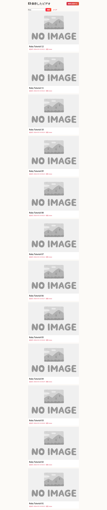
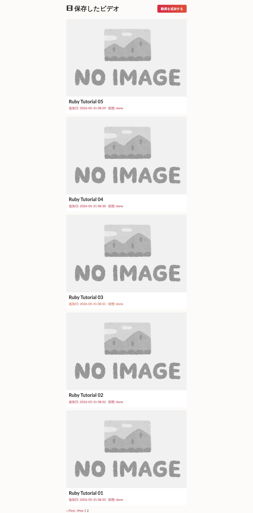
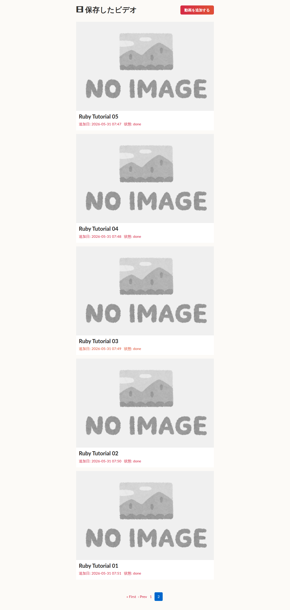
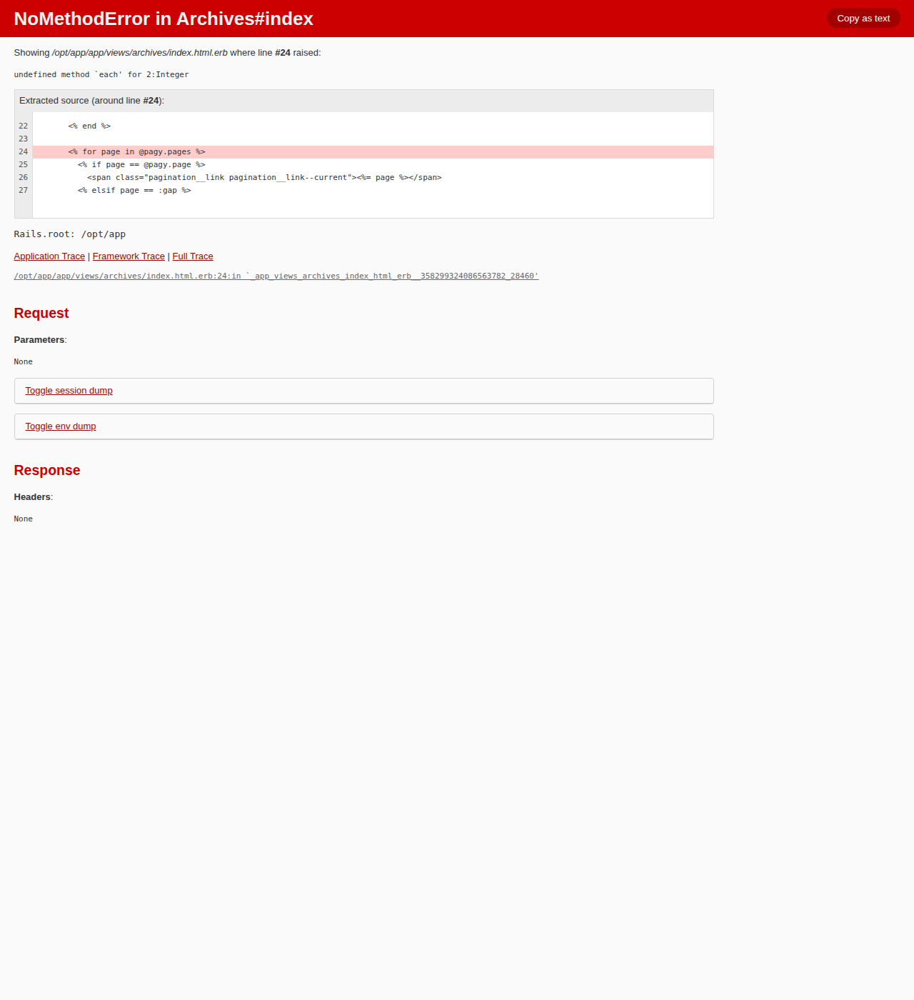
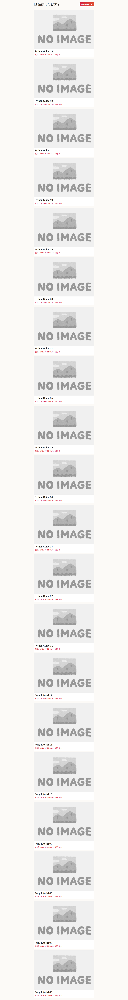

# opencode 機能追加ベンチマーク 再実施（正しい fork バイナリ・plan_exit 本来フロー）レポート

- 日時: 2026-05-31 09:35 JST
- 作成者: Claude

## 添付ファイル

- [実装プラン](attachment/2026-05-31_093533_opencode_feature_bench_rerun/plan.md)
- [全試行結果 TSV](attachment/2026-05-31_093533_opencode_feature_bench_rerun/results.tsv)
- [transition 一覧](attachment/2026-05-31_093533_opencode_feature_bench_rerun/results/transitions.tsv)
- 各試行の客観結果・差分・採点: `attachment/2026-05-31_093533_opencode_feature_bench_rerun/results/`（`*.json`/`*.diff`/`*.stat`/`judge_*.json`）
- ハーネス（再実施で追加・更新した分）: `attachment/2026-05-31_093533_opencode_feature_bench_rerun/harness/`
- スクリーンショット（本文に埋め込み。ディレクトリ: `attachment/2026-05-31_093533_opencode_feature_bench_rerun/screenshots/`）

## 前提条件・目的

- **背景**: 前回の機能追加ベンチ（[2026-05-30 機能追加ベンチ](./2026-05-30_064849_opencode_feature_bench.md)）は、`launch_trial.sh` が `~/.opencode/bin/opencode`（= **upstream 1.15.12**）をハードコードしていたため、**fork ではなく upstream を測っていた**ことが [2026-05-30 plan_exit ベンチ](./2026-05-30_222734_planexit_systemprompt_bench.md) で判明した。upstream には fork 独自の plan_exit 機構（`forcePlanExit`/synthetic safeguard）が無いため、「plan_exit が自発されない」という前回観測は **fork の挙動ではなく upstream の挙動**であり、前回は全 20 試行で人手の「Tab→build」代替を要していた。
- **目的**: 取り違え対策（`launch_trial.sh` の既定を fork の dist ビルドへ変更）を施したハーネスで、**前回と同一設計**のベンチ（検索/ページ × selfplan/givenplan × 5 = 20 試行、LLM as judge + Playwright 実機テスト）を **正しい fork バイナリ**で再実施する。本来の plan_exit 自発フロー（plan_exit→ダイアログ Yes→build、Tab→build 代替なし）で、(1) plan_exit が実際に自発されるか、(2) 成果物品質（前回の selfplan<givenplan 結論や pagy 故障）が再現するか、を測り直す。
- **評価**: 前回と同じ **claude code による LLM as judge**（correctness / idiomaticity / completeness / test_quality を各 1-5 + 総合 score）。加えて全試行に **Playwright + HTTP によるブラウザ実機ユーザーテスト**を実施。functional（実機動作）は `ok` フラグ（例外の有無）ではなく**実測値**で判定した（検索=絞込件数とタイトル一致、ページ=1ページ20件かつページネーション UI 検出かつ2ページ目5件）。

### 実験マトリクス（合計 20 試行）

| タスク | パターン | 試行 |
|---|---|---|
| 検索機能 | selfplan（要件のみ） | 5 |
| 検索機能 | givenplan（claude プラン提示） | 5 |
| ページネーション | selfplan | 5 |
| ページネーション | givenplan | 5 |

### タスク仕様（opencode へのプロンプト）

- **タスク1 検索**: 一覧（ArchivesController#index）に検索機能を追加 / `Archive#title` 部分一致 / 検索 UI を適切に配置 / **テストも実装して実行**。
- **タスク2 ページネーション**: 一覧にページネーション追加 / **1ページ20件** / ページ下部に UI 配置 / 既存テストが壊れないこと。（ユーザー仕様にテスト実装の明記なし → test_quality は新規テストが無くても過度に減点しない非対称採点。）

## 環境情報

- GPU/LLM サーバ: `t120h-p100`（10.1.4.14:8000, OpenAI 互換 API）
- モデル: `unsloth/Qwen3.6-35B-A3B-GGUF:UD-Q4_K_XL`（131072 ctx）
- **opencode: fork の dist ビルド `0.0.0-dev-202605302005`**（`packages/opencode/dist/opencode-linux-x64/bin/opencode`、起動時 `--version` で fork=`0.0.0-dev-*` を確認。前回の upstream `1.15.12` ではない）
- ベンチ対象: ytdlor（Rails 8.1.2 / Ruby 3.2.4 / PostgreSQL 14 / Minitest / docker-compose）
- ベース: `b61242f` + 機能開発用 `AGENTS.bench.md` の**クリーン setup**（前回実装の混入が無いことを `setup_clean.sh` で検証）から 20 worktree を fork
- ブラウザテスト: Playwright（chromium-headless-shell）。ytdlor を専用 docker compose プロジェクト `ytdlor-featbench`（port 3010）で起動し、本番・dev とは隔離。25 件（Ruby 12 / Python 13）のシードデータを投入して検証。

## 参照レポート

- [2026-05-30 機能追加ベンチ（前回・upstream 取り違え）](./2026-05-30_064849_opencode_feature_bench.md)
- [2026-05-30 plan_exit システムプロンプトベンチ（取り違え発見・対策）](./2026-05-30_222734_planexit_systemprompt_bench.md)
- [2026-05-21 Qwen3.6 5モデルベンチ](./2026-05-21_032451_qwen36_5model_bench.md)（LLM as judge 手法の元）

## ベンチマーク設計と駆動手順

各試行は次のフローで実行した（`run_all_e2e.sh` が claude 駆動の tmux 右ペインを介して逐次実行）:

1. `reset_to_setup.sh` でクリーン setup へ git reset。
2. `drive_plan_to_build.sh`（`COND=featbench2 OPENCODE_BIN=<fork dist>`）: `opencode <wt> --agent plan --prompt ...` で plan 起動 → **plan_exit 自発ダイアログ("switch to the build agent")を検出して Enter(Yes) で承認 → build エージェントが実装**。
3. build 完了待ち（busy→idle 検知）→ opencode 終了。
4. `evaluate_trial.sh`: app 起動（build+up+db:prepare+seed）→ 独立 `rails test` → Playwright 実機テスト＋スクショ → teardown。

**前回からの変更点はバイナリと駆動経路のみ**（fork dist ＋ `drive_plan_to_build.sh`）。タスク仕様・採点ルーブリック・シードデータ・隔離 docker 構成は前回と同一。

## 結果

### transition（plan_exit の帰結）

| transition | 件数 |
|---|---|
| **self_exit（plan_exit 自発 → ダイアログ Yes → build）** | **20 / 20** |
| tab_to_build（手動代替） | 0 |
| synthetic / stall | 0 |

- **全 20 試行で plan_exit が自発された**（plan エージェントがプランファイルを Write → plan_exit を呼び、ダイアログに Yes 応答して build へ遷移）。前回（upstream 1.15.12）は plan_exit が一切自発されず全 20 試行で Tab→build を要したのと対照的で、**fork dev では本来フローが 100% 機能する**ことを実証した。これは plan_exit ベンチ（dev 100% self_exit）の end-to-end での裏付けでもある。

### セル別サマリ（n=5）

| タスク | パターン | functional（実機動作） | test pass | judge score | correct | idiom | complete | test_q |
|---|---|---|---|---|---|---|---|---|
| 検索 | selfplan | **5/5** | 5/5 | **4.4** | 4.4 | 4.2 | 4.4 | 4.0 |
| 検索 | givenplan | **5/5** | 5/5 | **4.8** | 5.0 | 5.0 | 5.0 | 4.2 |
| ページ | selfplan | **3/5** | 5/5 | **3.6** | 3.8 | 3.6 | 3.8 | 3.0 |
| ページ | givenplan | **5/5** | 5/5 | **5.0** | 5.0 | 5.0 | 5.0 | 4.0 |

- **functional**: Playwright 実機テストの実測で機能が正しく動作（検索=部分一致で 25→12 件に絞込・全件タイトルに Ruby を含む / ページ=1ページ20件・ページネーション UI 検出・2ページ目5件）。
- **test pass**: claude が独立実行した `rails test` が 0 failures / 0 errors（**全 20 試行とも通過**）。

### パターン別（タスク横断, n=10）

| パターン | functional | judge score 平均 |
|---|---|---|
| **selfplan**（自己プラン） | **8/10** | **4.0** |
| **givenplan**（claude プラン提示） | **10/10** | **4.9** |

### 前回（upstream・誤バイナリ）との対比

| 指標 | 前回 (2026-05-30, upstream 1.15.12) | 今回 (fork dist) |
|---|---|---|
| plan_exit 自発（transition） | **0/20**（全て Tab→build 手動代替） | **20/20 self_exit** |
| functional 合計 | 18/20 | **18/20** |
| selfplan functional / score | 8/10 / 3.9 | 8/10 / 4.0 |
| givenplan functional / score | 10/10 / 4.8 | 10/10 / 4.9 |
| ページ selfplan の故障 | pagy 2件が実機クラッシュ | pagy 2件が実機故障（500クラッシュ1・UI欠落1） |

→ **品質に関する前回の主要結論はすべて再現**した（givenplan > selfplan、pagy の不安定さ、ユニットテストすり抜けの実機故障）。最大の差は **plan_exit が本来どおり自発され、人手の Tab→build 代替が一切不要になった**点である。

## 主要比較：自己プラン vs 与プラン

- **両タスクで givenplan が selfplan を上回った**（検索 4.8 vs 4.4、ページ 5.0 vs 3.6）。
- 効果が最も顕著なのは**ページネーション**。selfplan では opencode が gem 選定から行い、**`pagy` を選んだ 2 試行（r1/r5）が実機で故障**した一方、`kaminari` を選んだ試行（r2/r4）と gem 無しの手書き limit/offset（r3）は完全動作。givenplan は claude プランが `kaminari` を指定していたため **5/5 が完璧に動作**（しかも全 5 試行が `gem "kaminari"` ＋ `.page(params[:page]).per(20)` ＋ `paginate @archives` のほぼ同一実装に収束＝高い再現性）。
- 検索は機能はどちらも 5/5 動作したが、selfplan は **PostgreSQL で大文字小文字を区別する `LIKE`** を使う試行（r1/r3/r4）があり idiomaticity・correctness を落とした（実機では検索語 "Ruby" がシードのタイトル大文字と一致するため絞込自体は成功するが、小文字検索では漏れる）。ILIKE を使った selfplan r2/r5 は満点級。givenplan は `ILIKE` 指定が徹底され全試行で正しい。
- **示唆（前回と同一）**: ローカル 35B でも要件のみで実用的な機能を実装できるが、**ライブラリ選定や SQL 方言の細部で品質がばらつく**。具体的なプラン（gem・実装方針）を与えると、ばらつきが消え再現性高く高品質になる。

## 故障モード：ユニットテストをすり抜けた実機故障（重要・前回同様に再現）

ページネーション selfplan の **pagy を選んだ 2 試行は `rails test` を全通過したのにブラウザ実機で故障**した。**ブラウザ実機テストがユニットテストの見逃したバグを捕捉した**好例である。

- **page-selfplan-r1**（pagy 8.6.3）: view で `<% for page in @pagy.pages %>` と記述。`@pagy.pages` は**総ページ数の整数**（正しくはページ番号配列 `@pagy.series`）であり、整数を `for ... in` で反復すると `undefined method 'each' for 2:Integer`。テストデータは 1 件のため `@pagy.pages > 1` 分岐に未到達ですり抜け（rails test は 33 runs 0 failures）、実機（25件＝2ページ）で発火し **index が HTTP 500 クラッシュ**。
- **page-selfplan-r5**（pagy 43.4.4）: `Pagy::Offset` で 20 件 limit は正しく機能（クラッシュ無し）だが、view が `<% if defined?(pagy_nav) %>` でガードしており **`Pagy::Frontend` 未 include で `pagy_nav` が未定義 → nav ブロックが丸ごと描画されず**、ページネーション UI が一切出ない（2ページ目へ遷移できない）。`defined?` ガードが include 漏れを黙殺する anti-pattern で、要件「UIを下部に配置」を満たさない。

opencode（Qwen3.6-35B）は **pagy の API を正しく扱えていない**（バージョン指定も r1=8.6.3 / r5=43.4.4 とばらつき、`@pagy.series` 誤用・`Pagy::Frontend` include 漏れ）。学習データ的に枯れた `kaminari` の方が安定して正しく書ける、という前回の知見が再現した。

## スクリーンショット（実機テスト）

検索 selfplan-r2（"Ruby" 検索で 12 件に絞込・成功）:

ページ givenplan-r1（kaminari・2ページ目に5件＋ページネーション UI・成功）:

ページ selfplan-r4（kaminari・2ページ目5件・成功）:

故障例 page-selfplan-r1（pagy・`for page in @pagy.pages` で `undefined method 'each' for 2:Integer` → index 500）:

故障例 page-selfplan-r5（pagy・`pagy_nav` 未定義でページネーション UI が描画されず・下部に nav 無し）:

## その他の所見

- **所要時間**: givenplan は plan 段階が速い（plan フェーズ平均 ~2分 vs selfplan ~4分）。build はタスク・gem 解決により変動（kaminari/pagy の bundle 再ビルドを伴うページ givenplan は ~9-11分、検索は ~6分前後）。page-selfplan-r5（pagy 43.x）は依存解決の反復で約20分と突出した。
- **opencode の自律性**: build エージェントは Gemfile への gem 追加・`./docker_compose build` での bundle 解決・Gemfile.lock 更新・テスト実行までを自律的にこなせた（kaminari 群は Gemfile.lock も正しく更新）。
- **plan_exit**: 本ベンチの機能追加タスクでも **fork dev では plan_exit が 100% 自発**された。前回「タスク複雑度依存で plan_exit が自発されない」とした観測は upstream 1.15.12 固有であり、fork dev には当てはまらない（恒久文書の訂正どおり）。

## ハーネス上の知見・留意点（再実施で判明）

1. **Playwright の `ok` フラグは信頼できない（旧実装は誤誘導的）→ 修正済み**: `pw_test.mjs` の `ok` は当初「JS 例外が投げられなかったか」だけを表しており、**HTTP 500 のエラーページ（記事 0 件）でも、ページネーション UI が一切無くても `true`** になっていた。実際 page-selfplan-r1（500）も r5（nav 欠落）も `ok=true` を返した。集計を `ok` で組むと **page-selfplan が誤って 5/5 functional** と出るため、本ベンチの functional 判定は `ok` ではなく**実測値**（検索=絞込件数 < 全件かつ全件タイトル一致、ページ=1ページ20件かつ nav 検出かつ2ページ目5件）で行った。再発防止として `pw_test.mjs` の `ok` を**実測値の妥当性を満たした時だけ true**に修正し、例外時は `crashed` も記録するようにした（修正版は添付 `harness/pw_test.mjs`）。`ok` を信頼した過去の集計は pagy 故障を見逃しうる点に注意。

2. **selfplan のページネーション実装は「3 通り」に分岐した（前回は 2 通り）**: 前回は kaminari / pagy の 2 択だったが、今回は **page-selfplan-r3 が gem を一切使わず手書きの limit/offset**（`PER_PAGE=20`・`total_pages`・prev/next・番号リンク＋css）で実装し完全動作した。selfplan のばらつきは「どの gem を選ぶか」だけでなく「**そもそも gem を使うか**」にも及ぶ。要件のみを与えた場合の実装多様性が前回示唆より広いことを示す。

3. **self_exit 本来フローは駆動も安定（ハーネス的にクリーン）**: 20 試行を通じて **フォールバック 0・質問ダイアログ処理 0・external_directory stall 0・Update ダイアログ 0**（全 trial の drivebuild ログで確認）。前回の Tab→build 代替で必要だった「プラン提示後の質問ダイアログを Escape で閉じる」処理や「Explore サブエージェントの busy 誤判定」対策が、本来フローでは**そもそも発生しなかった**。plan_exit 自発は成果物品質だけでなく駆動の安定性にも寄与する。

4. **スクリーンショット PNG は run 間で消去されない（再現の落とし穴）**: `pw_test.mjs` は `result.json` を毎回上書きする一方 PNG は消さないため、`pageLinkCount=0` の試行（r1/r5）の `03_page2.png` は**前回 run の残存**だった。本レポートの故障例スクショは現在 run で必ず上書きされる `01_index.png`（r1 の 500）・`02_page1_bottom.png`（r5 の nav 欠落）のみを採用している。functional は JSON 実測値で判定したため結論には影響しないが、スクショを証拠採用する際の注意点（証拠採用前に該当 run で撮られたかを確認すべき）。

（補足・軽微: page-selfplan-r1 の app_up は index の 500 により HTTP ready 待ちで失敗し `APPUP_RC=1` となったが、シード自体は 25 件成功している＝500 は実装バグ起因。search-selfplan-r1 は scope ではなく `self.search` クラスメソッドで実装しておりやや非 Rails 的。）

## 再現方法

ハーネス一式は `/home/ubuntu/projects/opencode/tmp/feat-bench/`（`tmp/` は gitignore）。共有ツール（`launch_trial.sh`・`evaluate_trial.sh`・`pw_test.mjs`・`seed.rb`・`app_up.sh` 等）の元スナップショットは [plan_exit ベンチ](./2026-05-30_222734_planexit_systemprompt_bench.md) の `attachment/.../harness/` を参照。本再実施で追加・更新したスクリプトは本レポート添付 `harness/` に保存:

- `run_all_e2e.sh`: 20 試行を逐次 end-to-end 駆動（reset → drive_plan_to_build → evaluate）。`COND=featbench2`・`OPENCODE_BIN=<fork dist>`。
- `drive_plan_to_build.sh`: plan_exit 自発ダイアログで Enter(Yes)→build。synthetic は自動 build、stall は Tab フォールバック。
- `launch_trial.sh`: 既定バイナリを fork dist に修正済み・`--version` ログで取り違え検知。
- `collect_rerun.sh`: 差分メトリクスを `results/rerun/` に出力（前回成果物を上書きしない）。base は `clean_base_shas.tsv`。
- `build_json.py`: 各 trial の客観 JSON を組み立て（transition / 時間 / diff stat / rails test / browser 実測 / gem / functional 判定）。
- `write_judges.py`: claude の採点（4カテゴリ + 総合 + reason）を `judge_<trial>.json` に書き出し。
- `aggregate_rerun.py`: `results/rerun/results.tsv` とセル別/パターン別/transition 別サマリを生成。
- `pw_test.mjs`（修正版）: ブラウザ実機テスト。`ok` を実測値の妥当性（検索=絞込かつ全件一致／ページ=20件・nav 検出・2ページ目5件）で判定するよう修正し、例外時は `crashed` も記録（上記「ハーネス上の知見」1）。

各試行の客観結果・差分・採点は添付 `results/<trial>.{json,diff,stat}` + `judge_<trial>.json`、集計は `results.tsv`、plan_exit 帰結は `transitions.tsv` に保存。

## 結果・所見（まとめ）

- **正しい fork バイナリ（dist ビルド `0.0.0-dev-*`）で再実施したところ、機能追加タスクでも plan_exit が 20/20 で自発**され、ダイアログ Yes → build という本来のフローで人手介入（Tab→build）なしに実装まで到達した。前回の「plan_exit 非自発」は upstream 1.15.12 を測っていたことが原因で、fork dev では問題が存在しないことが end-to-end で確定した。
- **成果物品質に関する前回の主要結論はすべて再現**: 全 20 試行で独立テストは 0 failures、機能動作は **18/20**。**givenplan（10/10・4.9）が selfplan（8/10・4.0）を明確に上回り**、特にライブラリ選定（pagy 誤用）と SQL 方言（LIKE/ILIKE）のばらつきを抑制する効果が大きい。
- **ブラウザ実機テストの価値（再現）**: `rails test` を通過しても実機で動かない実装（pagy の `@pagy.pages` 整数反復で 500 クラッシュ／`pagy_nav` include 漏れで UI 非描画）を確実に捕捉した。テスト pass だけでは品質を担保できないことを改めて実証。
- **留保事項**: AGENTS.md を機能開発用に差替・external_directory を許可したのはベンチ成立のための運用調整（前回同様）。functional 判定は `ok` フラグ（例外有無）ではなく実測値（件数・nav 検出）で行った。
